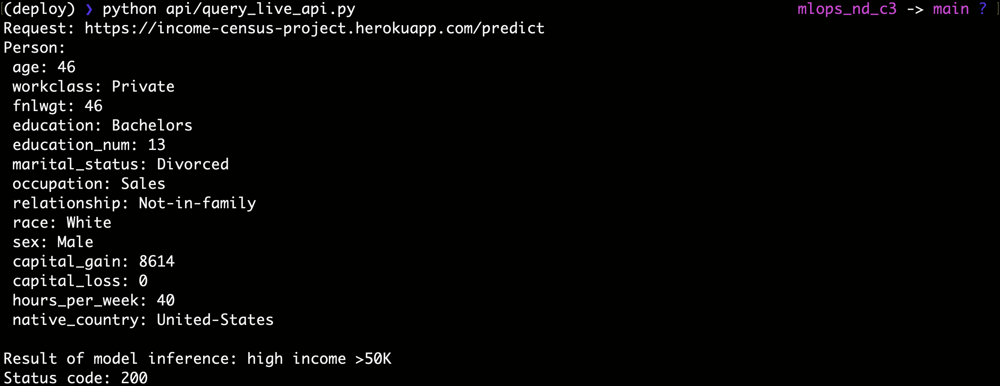

# Project Overview

In this project, we will apply the skills acquired in the ``Deploying a Scalable ML Pipeline in Production`` course to develop a classification model on publicly available [Census Bureau data](http://archive.ics.uci.edu/ml/datasets/Adult). 

We will create unit tests to monitor the model performance on various slices of the data. Then, we will deploy the final model using the FastAPI package and create API tests. Both the slice-validation and the API tests will be incorporated into a CI/CD framework using GitHub Actions. DVC will be used to manage the project dependencies (model, data, so on) and allow a reproducible pipeline.

## Environment Setup

Create a conda environment with ``environment.yml``:

```bash
conda env create --file environment.yml
```

To remove an environment in your terminal window run:

```bash
conda remove --name myenv --all
```

To list all available environments run:

```bash
conda env list
```

## Data Pipeline 

We will use DVC to manage and version the data processes that produce our final artifact. This mechanism allows you to organize the project better and reproduce your workflow/pipeline and results more quickly. The following steps are considered: a) ``data``, b) ``eda``, c) ``preprocess``, d) ``check data``, e) ``segregate``, f) ``train``, g) ``evaluate`` and h) ``check model``.

<center></center>

It is possible to generate a big-picture of the data pipeline using the DVC. *After we have create all stages*, please run:

```bash
dvc dag
```
and we can obtain the follow output:

<center></center>


### Data

It is assumed the data has already been fetched and stored at ``pipeline/01_data``.

Before starting the next pipeline stage, EDA, clone (git clone), or create a new git repository (git init) to the project. Right after, run:

```bash
dvc init
```

and track and version the file ``census.csv`` using:

```bash
dvc add pipeline/data/census.csv
git add pipeline/data/.gitignore pipeline/01_data/census.csv.dvc
```

It is possible tracking data remotely with DVC. In this project we will use a ``S3 bucket`` as configuration. Some aditional steps are necessary to setup the CLI environment. 

1. Install the [AWS CLI tool](https://docs.aws.amazon.com/cli/latest/userguide/cli-chap-install.html).
2. Sign in [AWS Amazon](https://aws.amazon.com/) using your user and password. 
3. From the Services drop down select ``S3`` and then click ``Create bucket``.
4. Give your bucket a name, the rest of the options can remain at their default.
5. To use your new ``S3 bucket`` from the AWS CLI you will need to create an ``IAM user`` with the appropriate permissions.
    - Sign in to the [IAM console](https://console.aws.amazon.com/iam/) or from the Services drop down on the upper navigation bar.
    - In the left navigation bar select ``Users``, then choose ``Add user``.
    - Give the user a name and select ``Programmatic access``.
    - In the permissions selector, search for S3 and give it ``AmazonS3FullAccess``.
    - ``Tags`` are optional and can be skipped.
    - After reviewing your choices, click ``create user``.
    - Configure your AWS CLI to use the Access key ID and Secret Access key.
    ```bash
    aws configure
    ```

Right after this setup, add the ``S3 remote bucket`` using:

```bash
dvc remote add name_of_remote_repo s3://name_of_s3_bucket
```

In our case, the configuration was:

```bash
dvc remote add s3remote s3://incomes3
```

To visualize the configuration run:

```bash
dvc remote list
```

Them push tracking files using:

```bash
dvc push --remote s3remote
```

### Exploratory Data Analysis (EDA)

For now, the artifacts generated by EDA are not tracked. EDA is only to understand the big-picture about the problem. 

### Preprocess

To create pipelines, use ``dvc run`` to create stages. In each stage you can define dependencies, parameters, inputs, outputs, and specify the command that is run. In order to create the preprocess stage run:

```bash
dvc run -n preprocess \
        -d pipeline/preprocess/run.py \
        -d pipeline/data/census.csv \
        -o pipeline/data/preprocessing_data.csv \
        python pipeline/preprocess/run.py --input_artifact_name pipeline/data/census.csv \
                                             --output_artifact_name pipeline/data/preprocessing_data.csv
```

To track the changes with git, run:

```bash
git add dvc.yaml pipeline/01_data/.gitignore dvc.lock
```

If everything is successful, new DVC files and a new artifact are generated in the repository. ``dvc.lock`` and ``dvc.yaml`` are  used to manage the pipeline whereas the clean data, ``preprocessing_data.csv``, must be placed at ``pipeline/01_data``.

Now, given the data and pipeline are up to date is time to upload local files to remote repository, please run:

```bash
dvc push --remote s3remote    
```

### Check Data

In this stage of the pipeline we will apply ``deterministic`` and ``non-deterministic`` tests to the ``preprocessing_data.csv``.

For most of the ``non-deterministic`` tests you need a reference dataset, and a dataset to be tested. This is useful when retraining, to make sure that the new training dataset has a similar distribution to the original dataset and therefore the method that was used originally is expected to work well.

We will use the [Kolmogorov-Smirnov](https://docs.scipy.org/doc/scipy/reference/generated/scipy.stats.ks_2samp.html) test for goodness of fit. Remember that the 2 sample KS test is used to test whether two vectors come from the same distribution (null hypothesis), or from two different distributions (alternative hypothesis), and it is non-parametric.


All tests will be implemented using the ``pytest``. An important aspect when using ``pytest`` is understanding the ``fixture's scope`` works.

The scope of the ``fixture`` can have a few legal values, described [here](https://docs.pytest.org/en/6.2.x/fixture.html#fixture-scopes). We are going to consider only ``session`` but it possible to use ``function``. In the former, the fixture is executed only once in a pytest session and the value it returns is used for all the tests that need it; with the latter, every test function gets a fresh copy of the data. This is useful if the tests modify the input in a way that make the other tests fail, for example. Let's see this more closely run this DVC pipeline:

```bash
dvc run -n datacheck \
        -p data.reference_dataset,data.ks_alpha \
        -d pipeline/check_data/conftest.py \
        -d pipeline/check_data/test_data.py \
        -d pipeline/data/preprocessing_data.csv \
        pytest pipeline/check_data -s -vv --sample_artifact pipeline/data/preprocessing_data.csv \
                                             --param params.yaml
                                             
git add dvc.yaml dvc.lock
```

To update the remote repository, please run:

```bash
dvc push --remote s3remote    
```

### Segregate

This stage of the pipeline splits the dataset into train/test, with the test accounting for 30% of the original dataset. The split is stratified according to the target to keep the same label balance. The test size, stratify column, and random seed used to reproducible issues can be changed in params.yaml file. 

```bash
dvc run -n segregate \
        -p data.test_size,data.stratify,main.random_seed \
        -d pipeline/data/preprocessing_data.csv \
        -d pipeline/segregate/run.py \
        -o pipeline/data/train_data.csv \
        -o pipeline/data/test_data.csv \
        python pipeline/segregate/run.py --input_artifact pipeline/data/preprocessing_data.csv \
                                            --param params.yaml

git add dvc.yaml dvc.lock
```

Now, given the data and pipeline are up to date is time to upload local files to remote repository, please run:

```bash
dvc push --remote s3remote    
```

### Train

This stage of the pipeline works on the training of the model. For the sake of understanding, a simple Decision Tree model was used only for a proof of concept. The focus is on the development of a complete workflow. Hyperparameters are configured using the ``params.yaml`` file. The workflow is based on [Scikit-Learn Pipelines](https://scikit-learn.org/stable/modules/generated/sklearn.pipeline.Pipeline.html). Overall, we have three pipelines, one to process the numerical features and the other to transform categorical features. The third pipeline is used to join previous ones. The final pipeline and encoder used to codify the target variables are saved using joblib library. 

```bash
dvc run -n train \
        -p train.export_artifact,data.val_size,data.stratify,main.random_seed \
        -M pipeline/data/train_scores.json \
        -d pipeline/data/train_data.csv \
        -d pipeline/train/run.py \
        -d pipeline/train/helper.py \
        -d pipeline/train/transformer_feature.py \
        -o pipeline/data/model_export \
        -o pipeline/data/encoder_export \
        python pipeline/train/run.py --train_data pipeline/data/train_data.csv \
                                        --param params.yaml --score_file pipeline/data/train_scores.json

git add dvc.yaml dvc.lock
```

Now, given the data and pipeline are up to date is time to upload local files to remote repository, please run:

```bash
dvc push --remote s3remote    
```

### Evaluate

In this stage we will build a component that fetches a model and target encoder and test them on the test dataset.

```bash
dvc run -n evaluate \
        -M pipeline/data/test_scores.json \
        -d pipeline/data/test_data.csv \
        -d pipeline/evaluate/run.py \
        -d pipeline/data/model_export \
        -d pipeline/train/helper.py \
        -d pipeline/train/transformer_feature.py \
        -d pipeline/data/encoder_export \
        -o pipeline/data/slice_output.json \
        python pipeline/evaluate/run.py --test_data pipeline/data/test_data.csv \
                                        --model pipeline/data/model_export \
                                        --encoder pipeline/data/encoder_export \
                                        --score_file pipeline/data/test_scores.json \
                                        --slice_file pipeline/data/slice_output.json

git add dvc.yaml dvc.lock
```

Now, given the data and pipeline are up to date is time to upload local files to remote repository, please run:

```bash
dvc push --remote s3remote    
```

### Check Model

In this stage we will write some unit tests to evaluate if any ML functions return the expected type.

```bash
dvc run -n check_model \
        -d pipeline/check_model/conftest.py \
        -d pipeline/check_model/test_model.py \
        -d pipeline/train/transformer_feature.py \
        -d pipeline/data/test_data.csv \
        -d pipeline/data/model_export \
        -d pipeline/data/encoder_export \
        pytest pipeline/check_model -s -vv --test_data pipeline/data/test_data.csv \
                                        --model pipeline/data/model_export \
                                        --encoder pipeline/data/encoder_export 

git add dvc.yaml dvc.lock
```

Now, given the data and pipeline are up to date is time to upload local files to remote repository, please run:

```bash
dvc push --remote s3remote    
```

## GitHub Actions

GitHub Actions is a new way to do continuous integration and continuous deployment right from Git. It comes with a handful of workflows such as running Linter or maybe checking in if there are any flake8 errors. You can configure GitHub Actions to trigger a deployment pipeline on push, giving you a fully automated Continuous Integration pipelines that helps keep your team in sync with the latest features.

In the context of this project, it was set up a simple workflow from the GitHub web interface according to the figure below.

<center></center>

All Actions are configured into the file ``main_actions.yml``. Details can be found [here](https://github.com/ivanovitchm/mlops_nd_c3/blob/main/.github/workflows/main_actions.yml). 
- Triggers the workflow: ``on push``
- The type of runner that the job will run on: ``macos-latest``
- Allow the job access the repository from: ``actions/checkout@v2``
- Set up DVC actions: ``iterative/setup-dvc@v1``
- Configure AWS credentials: ``aws-actions/configure-aws-credentials@v1``
    - Note that is necessary to configure the repository secrets: ``settings/secrets/actions``
- Set up Python version: ``actions/setup-python@v3.0.0``
- And run diverse commands to install dependencies (VM used by Github Actions), lint (flake8), pytest (data, model and API tests) and download artifacts (dvc pull).

A successful build of the proposed workflow is shown below. It is highlighted the DVC action where it is possible to note all tracked artifacts.

<center></center>

## API Deployment with FastAPI

[FastAPI](https://fastapi.tiangolo.com/) is a modern API framework that allows you to write code quickly without sacrificing flexibility or extensibility. FastAPI will be used in this project in order to conclude the CI/CD stages. After we build our API locally and test it, we will deploy it to [Heroku](https://www.heroku.com/) and test it again once live.

### API Creation

It was created and implemented a RESTful API using FastAPI containing the following features:

- Pydantic body with all columns and hints of an instance. 
- A ``schema extra`` describing an typical example of an instance according FastAPI [documentation](https://fastapi.tiangolo.com/tutorial/schema-extra-example/).
- GET on the root giving a welcome message.
- POST on the predict in order to proceed model inference. 
- Three unit test to test the API, one for the GET adn two for POST (high income >50k and low income <=50k)

The API is implemented in the ``api/main.py`` whereas tests are on ``api/test_main.py``.

For the sake of understanding and during the development, the API was constanly tested using:

```bash
uvicorn api.main:app --reload
```

and using these addresses:

```bash
http://127.0.0.1:8000/
http://127.0.0.1:8000/docs
```

The screenshot below show a view of the API docs.

<center></center>


For test the API, please run:

```bash
pytest api/test_main.py -vv
```

<center></center>


### API Deployment

1. The first step is to create a new app in [Heroku](https://dashboard.heroku.com/). It is very important to connect the APP to our Github repository and enable the automatic deploys. The figure below show a screenshot of this configuration.

<center></center>

2. Install the Heroku CLI following the [instructions](https://devcenter.heroku.com/articles/heroku-cli).
3. In the root folder of the project, check the heroku projects already created.
```bash
heroku apps
```
4. Check buildpack is correct: 
```bash
heroku buildpacks --app income-census-project
```
5. Update the buildpack if necessary:
```bash
heroku buildpacks:set heroku/python --app income-census-project
```
6. Set up access to AWS on Heroku, if using the CLI: 
```bash
heroku config:set AWS_ACCESS_KEY_ID=xxx AWS_SECRET_ACCESS_KEY=yyy --app income-census-project
```
7. We need to give Heroku the ability to pull in data from DVC upon app start up. We will install a [buildpack](https://elements.heroku.com/buildpacks/heroku/heroku-buildpack-apt) that allows the installation of apt-files and then define the Aptfile that contains a path to DVC. I.e., in the CLI run:

```bash
heroku buildpacks:add --index 1 heroku-community/apt --app income-census-project
```
8. Then in your root project folder create a file called ``Aptfile`` that specifies the release of DVC you want installed, e.g.
https://github.com/iterative/dvc/releases/download/2.0.18/dvc_2.0.18_amd64.deb
9. Add the following code block to your ``api/main.py``:

```python
import os

if "DYNO" in os.environ and os.path.isdir(".dvc"):
    os.system("dvc config core.no_scm true")
    if os.system("dvc pull -r s3remote") != 0:
        exit("dvc pull failed")
    os.system("rm -r .dvc .apt/usr/lib/dvc")
```

10. Configure the remote repository for Heroku:
```bash
heroku git:remote --app income-census-project
```
11. Push all files to remote repository in Heroku. The command below will install all packages indicated in ``requirements.txt`` in Heroku VM. Note the free tier support a slug until 500 MB. Our slug size was 488 MB!!!
```bash
git push heroku main
```
12. Check the remote files run:
```bash
heroku run bash --app income-census-project
```
13. If all previous steps were done with successful you will see the message below after open: ``https://income-census-project.herokuapp.com/``.

<center></center>

14. At the end, we can run a query live API from:

```bash
python api/query_live_api.py 
```

The result of this run can be better visualized in the figure below. 

<center></center>

15. In case you prefer, the query live API can be tested using FastAPI docs. In a browser, please run:

```bash
https://income-census-project.herokuapp.com/docs
```

Right after, click in ``Try it out``. Note, in this case, that example is different that used in the step 14!!!

<center></center>

The response of the query live API can be also visualized in the browser according to figure below:

<center></center>


